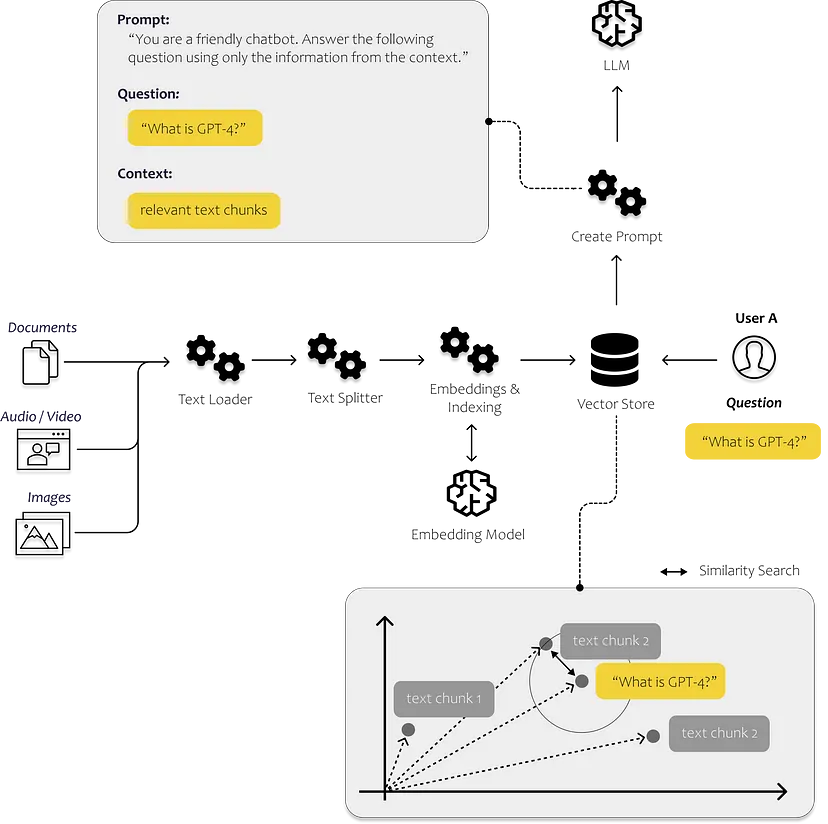

# Innovative Project Solutions with LangChain's Language-Driven Approach

Here is a collection of LLM projects that I have created. Feel free to utilize these projects according to your needs. Harness the power of language and let these projects assist you in your various endeavors. Explore new possibilities and gain fresh insights with the help of these versatile language models. Don't hesitate to maximize your creativity with these projects and witness the wonders they can bring to your applications. Unlock the potential of artificial intelligence (AI) and embark on a journey of innovation and discovery. Together, let's surpass existing boundaries and discover new possibilities with this language technology.

Here is a list of the projects I have created:
1. [Autonomous HR-ChatBot](https://github.com/fahmiaziz98/langchain_project/tree/main/autonomus-hr-chatbot)

With these projects, you can optimize various aspects of your business using the advanced capabilities of language technology. I will also continue updating and creating new projects as time goes on.

refrence : https://towardsdatascience.com/all-you-need-to-know-to-build-your-first-llm-app-eb982c78ffac