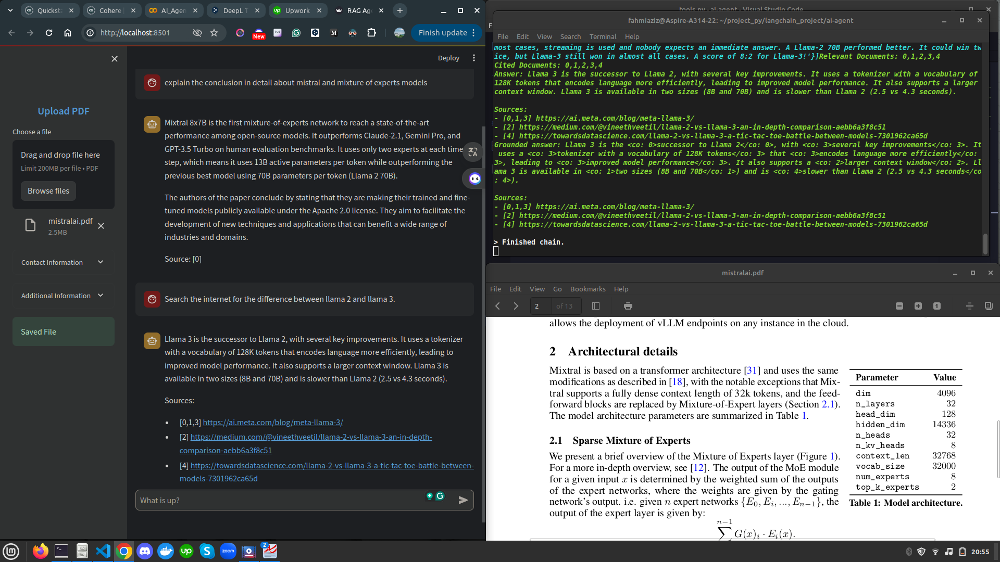

# RAG Agent

RAG Agent is an application that uses the `command-r-plus` model from Cohere to answer user-submitted questions. The application is designed to provide accurate and relevant answers based on the given context. This application is also assisted by an internet search tool, so when users ask questions outside the given context, it will search the internet for answers.

## Features
- Search Tool: Integrates with internet search to fetch answers outside the given context.
- Vector Database Tool: Utilizes a vector database for efficient and relevant data retrieval.
## Limitations
- Users must phrase their prompts specifically. For example: “please search the internet for...”.

## Set Up Environment Variables

1. Move to directories
    ```bash
    cd ai-agent
    ```
2. Copy the example environment file and update it with your API key.
    ```bash
    cp .env.example .env
    ```
3. Edit the .env file to include your Cohere & TavilySearch API key:
    ```bash
    COHERE_API_KEY=your_cohere_api_key_here
    TAVILY_API_KEY=your_tavily_api_key_here
    ```
## Running the Application

After installing all dependencies, you can run the Streamlit application with the following command:
```bash
streamlit run app.py
```

## Preview

