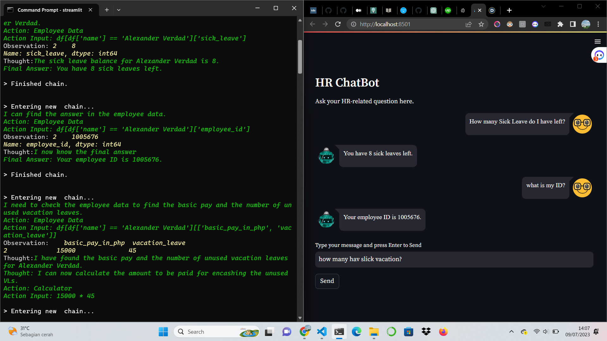
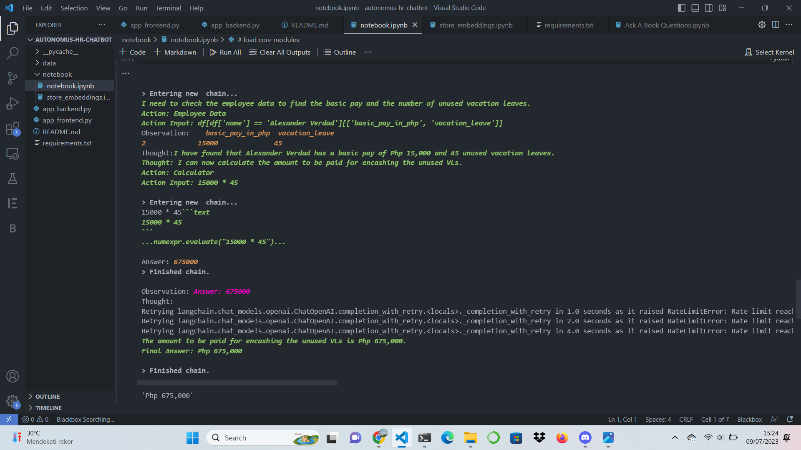

# Autonomus HR-ChatBot
## Description
Description
HR ChatBot is an endeavor to create a prototype enterprise application that utilizes LLM (Large Language Model) and implements its concepts. This ChatBot is built using LangChain's agent and tool modules and powered by ChatGPT or gpt-3.5-turbo models, with Pinecone serving as the vector database. The user interface is developed using Streamlit and the streamlit_chat component. I provide three tools in this ChatBot: Timekeeping Policy, Employee Data, and Calculator. Each tool is accompanied by a description to assist the LLM in determining the specific situations where the tool is best suited. The more detailed the description, the better the results obtained.

The available tools are as follows:
- Timekeeping Policy: A sample HR policy document generated by ChatGPT. The document's embeddings are created using OpenAI's text-embedding-ada-002 model and stored in the Pinecone index.
- Employee Data: A CSV file containing dummy employee data (such as name, supervisor, number of leaves, etc.). The data is loaded as a Pandas DataFrame and manipulated by the LLM using LangChain's PythonAstREPLTool.
- Calculator: This is LangChain's calculator chain module, LLMMathChain.

### Sample Chat


### Sample Tool


## Instruction
- Install python 3.9 or higher
- Create [OpenAI](https://platform.openai.com/) account, and get your [API_KEYS](https://platform.openai.com/account/api-keys). Save the API_KEY as an environment variable.
- Create a [Pinecone](pinecone.io) account there is a free tier. Take note of the Pinecone API and environment values.
- Run the notebook 'store_embeddings.ipynb'. Replace the Pinecone and OpenAI API keys (for the embedding model) with your own.
Clone the repo to a local directory.
    ```
    git clone https://github.com/fahmiaziz98/langchain_project.git
    ```
- Navigate to the local directory and run this command in your terminal to install all prerequisite modules  `pip install -r requirements.txt`
- Input your own API keys in the app_backend.py file 
- Run `streamlit run app_frontend.py` in your terminal

## Conclusion
The HR-ChatBot project aims to streamline HR-related tasks and provide efficient assistance through the use of LLM technology. By leveraging LangChain's agent and tool modules, along with powerful language models such as ChatGPT or gpt-3.5-turbo, the chatbot is able to handle a variety of HR queries and perform calculations.

With the intuitive user interface developed using Streamlit, interacting with the HR-ChatBot is seamless and user-friendly. The provided tools, including Timekeeping Policies, Employee Data, and Calculator, offer a comprehensive range of functionalities to address different HR needs.

As an open-source project, contributions from the community are highly encouraged. Feel free to contribute enhancements, report issues, or suggest new features through GitHub. Together, let's continue to refine and expand the capabilities of the HR-ChatBot.

We hope that this HR-ChatBot proves to be a valuable asset in streamlining HR operations and providing prompt and accurate information to users.

Thank you for your interest in the HR-ChatBot project. Happy chatting!

