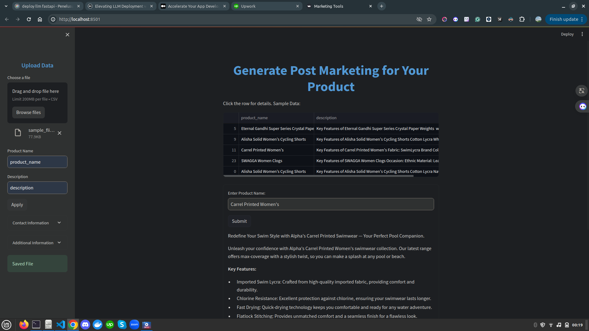

# Generate Post Marketing for Your Product
This tool uses Cohere's `command-r-plus` large language model (LLM) to automatically generate marketing posts for your products. Simply upload a CSV file containing your product data, including product names and descriptions (with specifications), and the tool will create marketing posts for you.

## Features
- Automatic generation of marketing posts based on product data.
- Uses advanced language model capabilities for high-quality text generation.
## Limitations
- Currently does not support integration with social media platforms.
## Data
Sample data can be found on Kaggle: [Flipkart Product](https://www.kaggle.com/datasets/PromptCloudHQ/flipkart-products)

## Set Up Environment Variables
1. Move to directories
    ```bash
    cd marketing
    ```
2. After installing all dependencies, you can run the Streamlit application with the following command:
    ```bash
    streamlit run app.py
    ```

## Usage
1. Upload Your Data
    - In the sidebar, upload your CSV file. Ensure the file contains columns for product names and descriptions.
    - Enter the column names for the product name and description fields.
    - Click "Apply" to process the uploaded data.
2. Generate Marketing Posts
    - In the main interface, enter a product name to generate a marketing post.
    - Click "Submit" to see the generated marketing post.

## Preview
